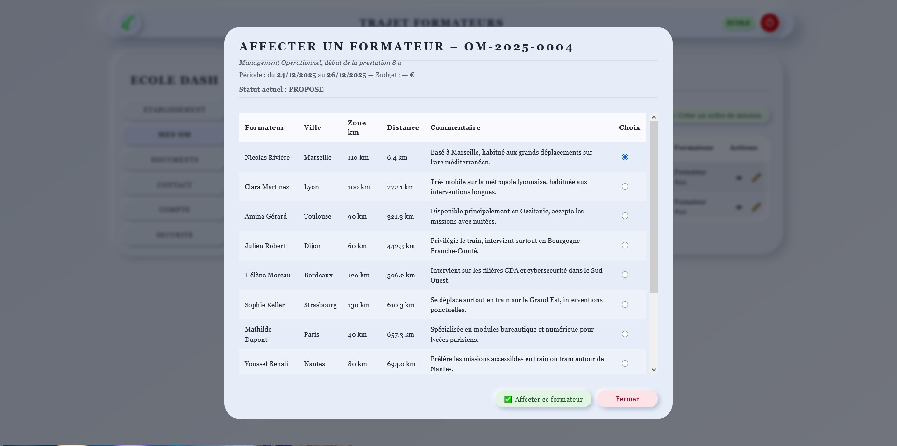

# 🚗 Trajet-Formateur

> Fullstack business application built with React (Vite) & Spring Boot.  
> Designed to manage trainer mobility, optimize travel feasibility and prepare GPS-based decision support.


<p align="center">
  
</p>

---

## 🧠 Business Context

Trajet-Formateur extends the planning logic by introducing a critical real-world constraint: **logistics and mobility**.

In professional training organizations:

- Trainers travel between multiple schools
- Travel time directly impacts session feasibility
- Excessive distance may invalidate an assignment
- Mobility generates financial and operational constraints

This project focuses on transforming **geographical data into business decisions**.

---

## 🎯 Project Objectives

- Centralize trainer mobility data
- Calculate travel distance & duration
- Validate assignment feasibility based on time constraints
- Prepare integration of external GPS APIs
- Secure all operations via JWT authentication

---

## 🏗 Business Logic Example

When assigning a trainer to a session:

1. The system calculates estimated travel duration
2. It verifies compatibility with session start time
3. If travel exceeds allowed margin → assignment is rejected

Core validation logic:
if (travelDuration > allowedMarginBeforeSession) {
rejectAssignment();
}


This ensures decision-making happens **server-side**, not only in the UI.

---

## 🗂 Data Model

Main entities:

- Formateur
- École
- Session
- Trajet

Each `Trajet` stores:
- Distance
- Estimated duration
- Status
- Compatibility validation

The design supports future extension toward full GPS integration.

---

## 🛠 Tech Stack

### Frontend
- React (Vite)
- Axios
- Component-based architecture
- Structured UI for logistics visualization

### Backend
- Spring Boot
- Spring Security
- JWT Authentication
- JPA / Repository pattern
- MariaDB
- DTO architecture

---

## 🔐 Security

- Role-based access control
- JWT authentication
- Protected API routes
- Server-side validation
- Clear business error handling

---

## 🌍 GPS Integration Preparation

This project introduces preparation for external API consumption:

- Study of OpenRouteService
- Study of Mapbox
- Study of Google Maps API
- Secure API key handling
- External dependency management
- Error resilience strategy

The architecture is designed to support a future cartographic interface.

---

## 🏗 Architecture

Backend structure:

Controller → Service → Repository → Database

Principles applied:

- Separation of concerns
- Business logic encapsulation
- DTO isolation layer
- Error handling discipline
- Evolutive design

---

## 📈 Skills Demonstrated

- Business analysis in logistics context
- Geo-data handling preparation
- REST API design
- Secure authentication system
- Server-side decision validation
- Extensible architecture thinking

---

## ▶️ Demo

🎥 Video presentation:  
(ajouter ici le lien si tu veux)

🌍 Portfolio page:  
https://spiritzen.github.io/portfolio/

---

## ⚙️ Run Locally

### Backend

```bash
cd backend
mvn spring-boot:run

cd frontend
npm install
npm run dev

### 👤 Author

Sébastien Cantrelle
Fullstack Developer – Java / Spring Boot / React
Amiens (France) – Open to remote opportunities

🔗 LinkedIn
https://www.linkedin.com/in/sebastien-cantrelle-26b695106/

🌍 Portfolio
https://spiritzen.github.io/portfolio/